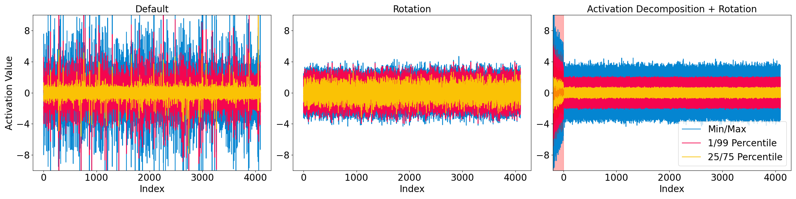

# QUAD

| <a href="https://arxiv.org/pdf/2503.19353"><b>Paper</b></a> |

<!-- ---

*News* 🔥
- [2025/4] QUAD is now available on [arXiv](https://arxiv.org/pdf/2503.19353).

--- -->

## Introduction

QUAD is a new model quantization approach for large language models. QUAD is based on existing rotation-based methods such as [QuaRot](https://github.com/spcl/QuaRot), on which QUAD additionally introduces the projection transform via projection matrix $P$ to remove outlier in activations for better quantization. The matrix $ P$ has two key properties: (1) it shifts outliers in activations to an additional $r$ dimension, thereby eliminating outliers in the original activations; (2) it satisfies $ P^\top P = I$. After transformation, for GEMM computations, most weights and activations are quantized to 4 bits, while the $r$ outlier dimensions and their corresponding weights are retained in full precision. 

Beyond removing activation outliers, QUAD can also be applied to parameter-efficient fine-tuning of quantized models. Specifically, we retain the weights corresponding to the outlier dimensions in full precision, meaning these portions of weights can serve as parameter-efficient adapters to fine-tune the model.

## Dataset

This project relies on the following dataset for calibration and fine-tuning.
- c4 (128 samples for calibration): https://huggingface.co/datasets/allenai/c4
- alpaca: https://huggingface.co/datasets/yahma/alpaca-cleaned
- code-feedback: https://huggingface.co/datasets/HuggingFaceH4/Code-Feedback
- meta-math-qa: https://huggingface.co/datasets/meta-math/MetaMathQA
- wikitext: https://huggingface.co/datasets/Salesforce/wikitext

## Quantization

Example script for model quantization can be found in `scripts/quant_quad.sh`.

## Fine-tuning

Example script for fine-tuning quantized model can be found in `scripts/finetune_quad.sh`.

## Evaluation

Example script for evaluate quantized model can be found in `scripts/eval_quad.sh`.

## Speedup

Example script for evaluate speedup of quantized model can be found in `scripts/speedup_quad.sh`.

## Acknowledgement

This project is partially based on [QuaRot](https://github.com/spcl/QuaRot).

The project utilizes CUDA kernels developed on [CUTLASS](https://github.com/NVIDIA/cutlass/tree/main) and [Tilelang](https://github.com/tile-ai/tilelang).